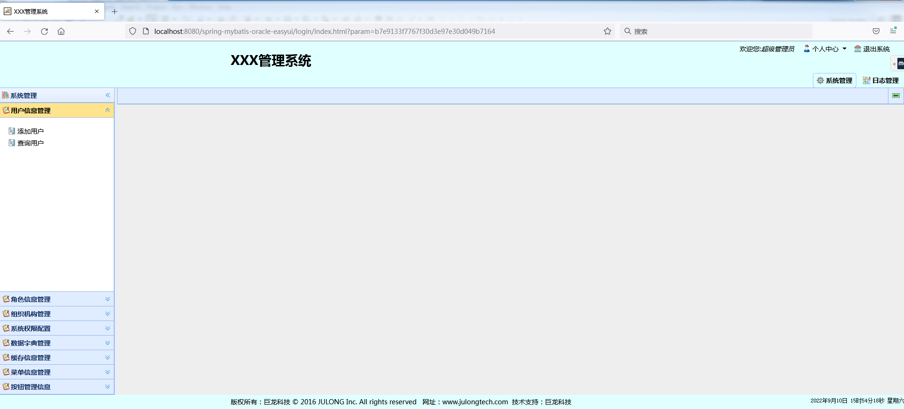
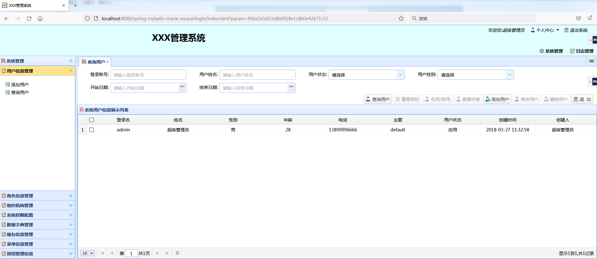
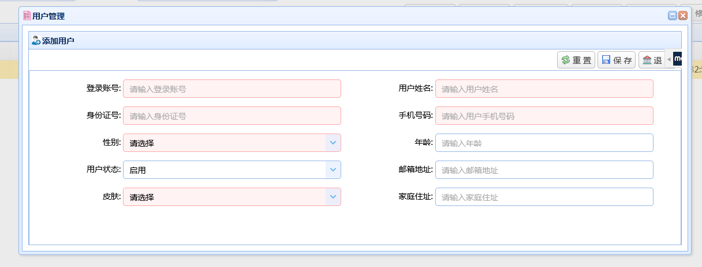
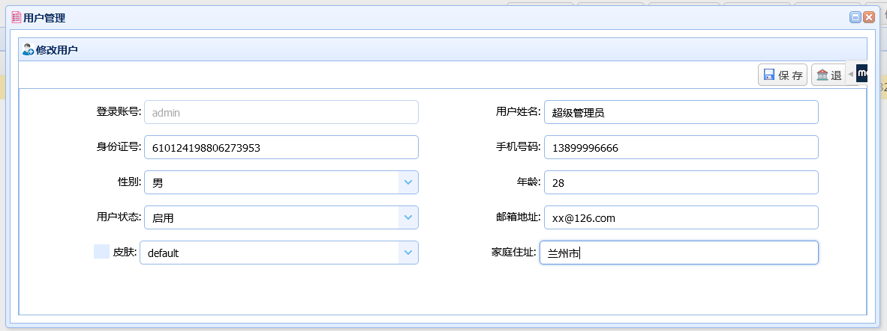

# spring-mybatis-mysql-easyui
spring+mybatis+mysql+easyui+redis实现的后台管理


spring版本：3.2.8.RELEASE

mybatis版本：3.2.0

mysql版本：5.6

easyui版本：1.7.5

redis版本：2.8.0


# 项目配置解释

## 项目目录结构

```txt
src/main/java 主配置目录 公共文件
src/main/system 系统管理目录 系统菜单用户日志登录等功能
src/main/resources 配置文件目录
src/test/java 测试目录
```


### src/main/java

```txt
com.julongtech.converter 时间转换包
com.julongtech.exception 异常处理包
com.julongtech.filter 过滤器
com.julongtech.page 分页
com.julongtech.util 公共类
com.julongtech.util.crypto 加密算法
com.julongtech.web.listener web启动自定义侦听拦截处理类
```

### src/main/system

```txt
com.julongtech.security.configuration 登录拦截配置
com.julongtech.security.filter 登录拦截过滤
com.julongtech.system.action 
com.julongtech.system.action.vo 页面输入的参数封装类
com.julongtech.system.aspect 自定义切面
com.julongtech.system.dao
com.julongtech.system.dao.entity 实体类与数据库字段匹配
com.julongtech.system.dao.mapper mybatis 生成的sql.xml 存储位置
com.julongtech.system.interceptor 拦截器过滤
com.julongtech.system.manager
com.julongtech.system.manager.impl
com.julongtech.system.service
com.julongtech.system.service.dto 请求数据库返回的实体类
com.julongtech.system.service.impl
com.julongtech.system.session 全局session 对象管理
com.julongtech.system.util 公用类
```


### src/main/resources

```txt
mybatis
	mybatis-config.xml mybatis配置文件
spring
	applicationContext-database.xml 数据库配置
    applicationContext-druid.xml 数据库监控配置
    applicationContext-redis.xml redis 配置
    applicationContext-security.xml spring登录配置
    applicationContext-task.xml 定时任务
    applicationContext-transaction.xml 事务
    applicationContext.xml 总配置
	ssm-servlet.xml springmvc 配置文件
application.properties 
jdbc.properties 数据库连接配置
log4j.properties 日志配置
redis.properties redis属性配置
system_mysql.sql sql语句
```


### src/main/webapp

```txt
commons 公共文件
    css
    images
    js
plugin  插件
	base64
    ckeditor
    easyui
    echarts
    jquery-fileupload
    jsencrypt
    md5
WEB-INF 页面目录
	pages
	web.xml  web服务配置文件
login.jsp 登录页面
```


### 1. 登录模块


密码实现rsa加密传输、验证码一分钟失效、三次输入错误锁定账户操作


### 2.首页




3.用户模块



新增用户



修改用户




基本的系统管理功能均已实现
